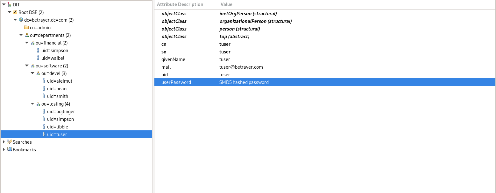
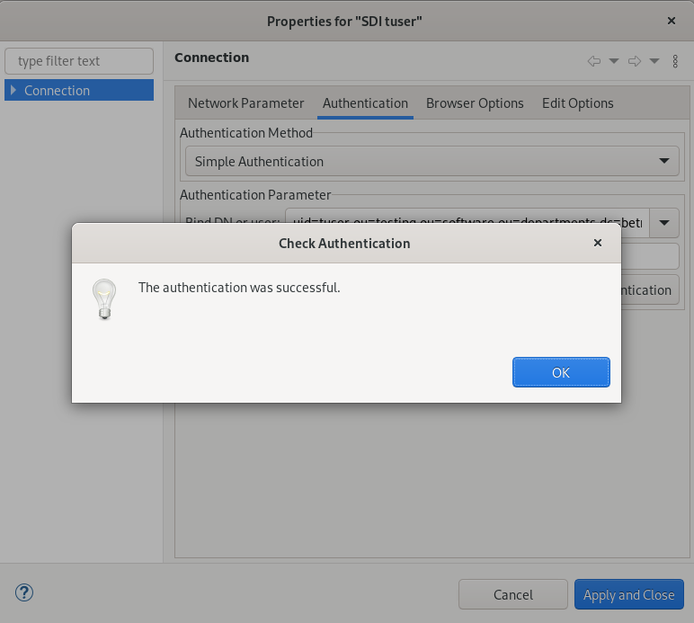
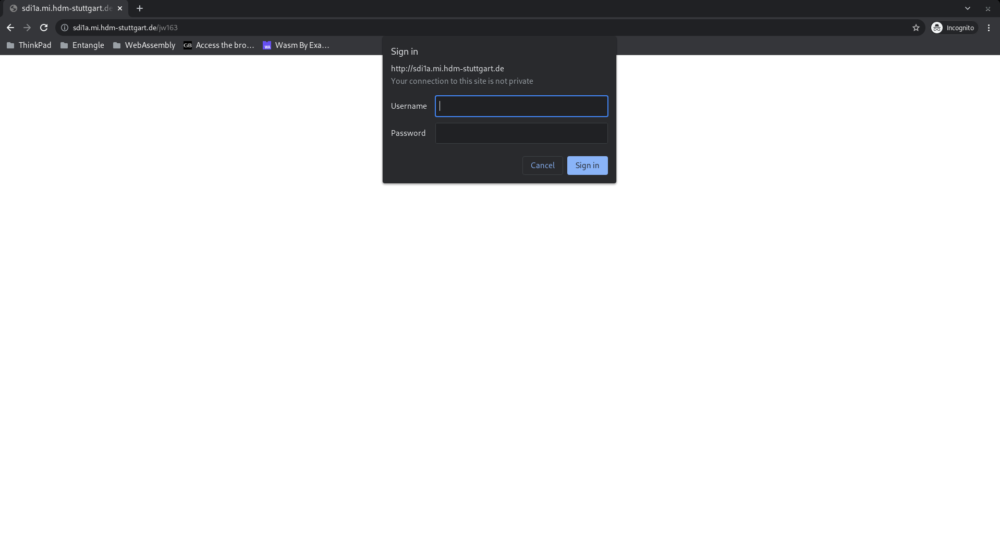
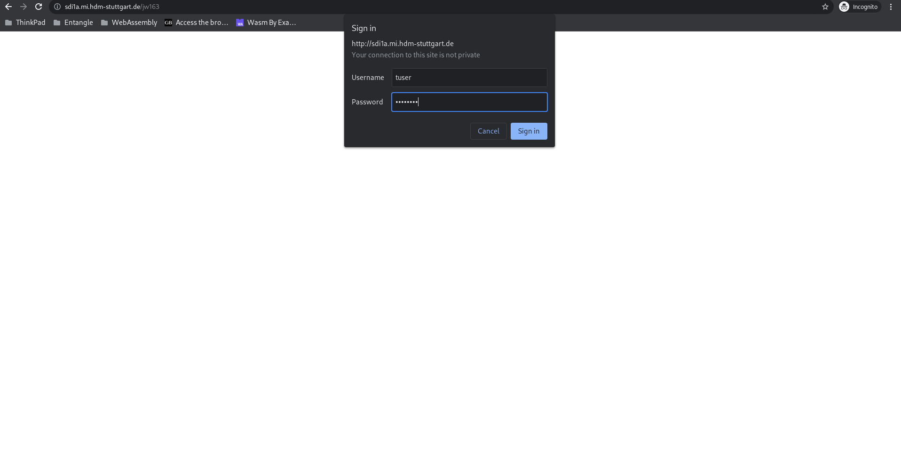
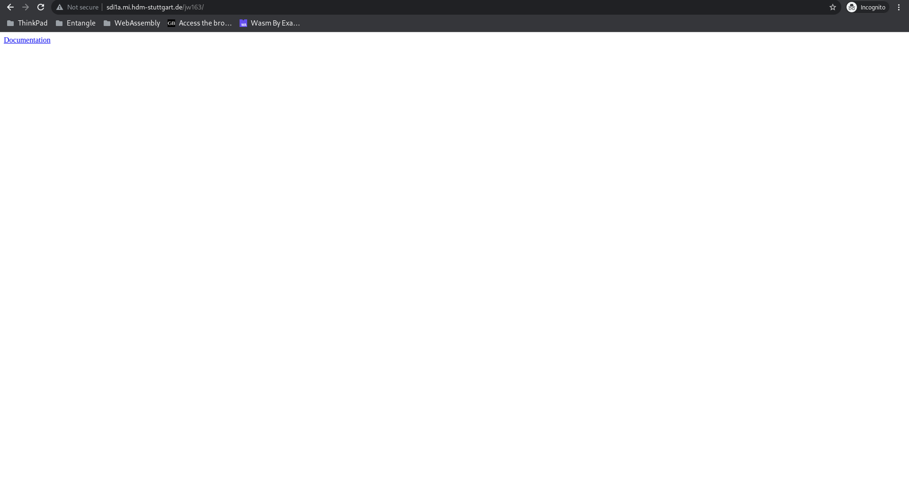
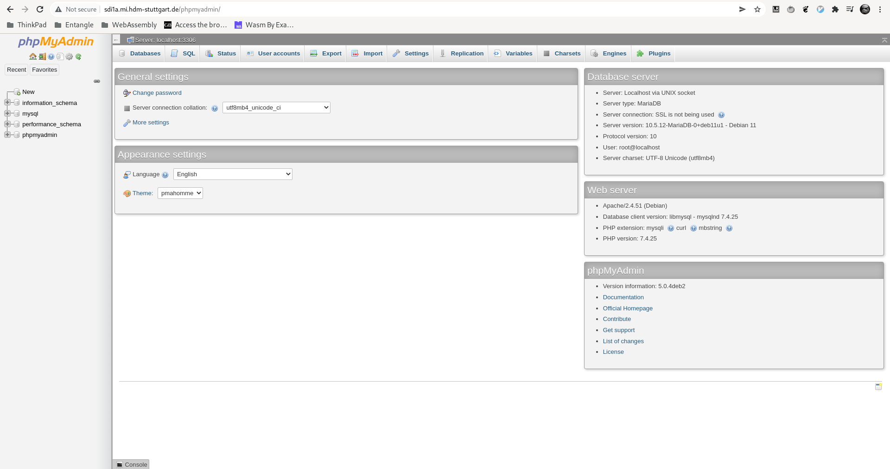
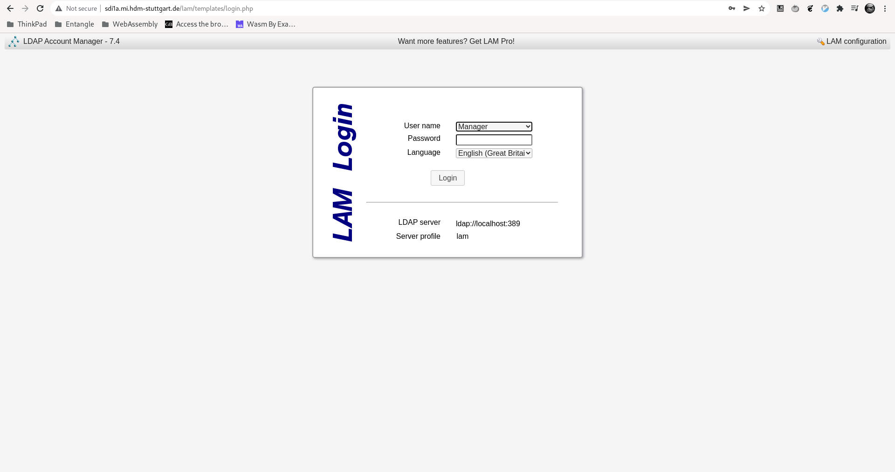
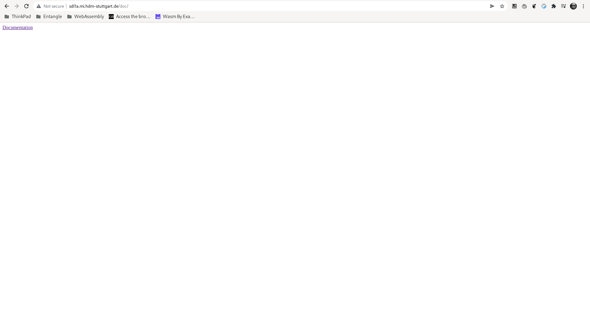

# Apache Exercises

## First steps 

Install the Apache Web Server:

```shell
apt install apache2
```

Start the `apache2.service`:

```shell
systemctl start apache2.service
```

Check the status of the `apache2.service` service to make sure everything works accordingly:

```shell
# systemctl status apache2.service
● apache2.service - The Apache HTTP Server
     Loaded: loaded (/lib/systemd/system/apache2.service; enabled; vendor preset: enabled)
     Active: active (running) since Mon 2021-11-22 14:42:17 CET; 8min ago
       Docs: https://httpd.apache.org/docs/2.4/
    Process: 11835 ExecStart=/usr/sbin/apachectl start (code=exited, status=0/SUCCESS)
   Main PID: 11839 (apache2)
      Tasks: 55 (limit: 4915)
     Memory: 5.7M
     CGroup: /system.slice/apache2.service
             ├─11839 /usr/sbin/apache2 -k start
             ├─11840 /usr/sbin/apache2 -k start
             └─11841 /usr/sbin/apache2 -k start

Nov 22 14:42:17 sdi1a systemd[1]: Starting The Apache HTTP Server...
Nov 22 14:42:17 sdi1a systemd[1]: Started The Apache HTTP Server.
```

### Move the original HTML start document to a backup location doc.html. What do you observe when accessing your server?

The original html file is located at `/var/www/html`. 

```shell
# mv index.html doc.html
```

Now observe what's running on the website after reloading the service with `systemctl reload apache2.service`: 

```shell
# curl 127.0.0.1:80
<!DOCTYPE HTML PUBLIC "-//W3C//DTD HTML 3.2 Final//EN">
<html>
 <head>
  <title>Index of /</title>
 </head>
 <body>
<h1>Index of /</h1>
  <table>
   <tr><th valign="top"></th><th><a href="?C=N;O=D">Name</a></th><th><a href="?C=M;O=A">Last modified</a></th><th><a href="?C=S;O=A">Size</a></th><th><a href="?C=D;O=A">Description</a></th></tr>
   <tr><th colspan="5"><hr></th></tr>
<tr><td valign="top"></td><td><a href="doc.html">doc.html</a></td><td align="right">2021-11-22 14:55  </td><td align="right"> 10K</td><td>&nbsp;</td></tr>
   <tr><th colspan="5"><hr></th></tr>
</table>
<address>Apache/2.4.51 (Debian) Server at 127.0.0.1 Port 80</address>
</body></html>
```

### Provide your own root index.html document and access your server's root again.

Now we can create our own `index.html`: 

```shell 
# curl 127.0.0.1
Hello World!
```

### Install the Apache documentation being contained in the Ubuntu package apache2-doc. How do you find your server's URL access path to it (Apart from asking Google or Stackoverflow)? 

Just look at the backup of the first `index.html` which should now be named `doc.html`. In this file, there is a link to `/manual/`:

```html
...
<div class="content_section_text">
          <p>
                Debian's Apache2 default configuration is different from the
                upstream default configuration, and split into several files optimized for
                interaction with Debian tools. The configuration system is
                <b>fully documented in
                /usr/share/doc/apache2/README.Debian.gz</b>. Refer to this for the full
                documentation. Documentation for the web server itself can be
                found by accessing the <a href="/manual">manual</a> if the <tt>apache2-doc</tt>
                package was installed on this server.

          </p>
          <p>
...
```

Now we can just look at whats running on `127.0.0.1/manual/`.

```shell
# curl 127.0.0.1/manual/
<html><head><meta http-equiv="refresh" content="0; URL=en/index.html"></head>
<body>
<table><tr><td><a href="da/index.html">da/</a></td></tr>
<tr><td><a href="de/index.html">de/</a></td></tr>
<tr><td><a href="en/index.html">en/</a></td></tr>
<tr><td><a href="es/index.html">es/</a></td></tr>
<tr><td><a href="fr/index.html">fr/</a></td></tr>
<tr><td><a href="ja/index.html">ja/</a></td></tr>
<tr><td><a href="ko/index.html">ko/</a></td></tr>
<tr><td><a href="pt-br/index.html">pt-br/</a></td></tr>
<tr><td><a href="ru/index.html">ru/</a></td></tr>
<tr><td><a href="tr/index.html">tr/</a></td></tr>
<tr><td><a href="zh-cn/index.html">zh-cn/</a></td></tr>
```
<!-- `# chown -R www-data /var/www/` -->

### Upload your current HTML documentation to a directory /home/sdidoc. Then modify your web server's configuration accordingly to access this directory by the URL http://sdi....mi.hdm-stuttgart.de/xy123 replacing “xy123” by your user name. 

Create the directory `/var/www/sdidoc` and add a your documentation to the folder.

Just modify the /etc/apache2/mods-available/alias.conf file: 

```shell
<IfModule alias_module>
        # Aliases: Add here as many aliases as you need (with no limit). The format is
        # Alias fakename realname
        #
        # Note that if you include a trailing / on fakename then the server will
        # require it to be present in the URL.  So "/icons" isn't aliased in this
        # example, only "/icons/".  If the fakename is slash-terminated, then the
        # realname must also be slash terminated, and if the fakename omits the
        # trailing slash, the realname must also omit it.
        #
        # We include the /icons/ alias for FancyIndexed directory listings.  If
        # you do not use FancyIndexing, you may comment this out.

        Alias /icons/ "/usr/share/apache2/icons/"

        <Directory "/usr/share/apache2/icons">
                Options FollowSymlinks
                AllowOverride None
                Require all granted
        </Directory>

        Alias /jw163/ "/var/www/sdidoc/"

        <Directory "/var/www/sdidoc">
                Options FollowSymlinks
                AllowOverride None
                Require all granted
        </Directory>

</IfModule>

# vim: syntax=apache ts=4 sw=4 sts=4 sr noet
```

Test if everything works: 

```shell
# curl 127.0.0.1/jw163/
<a href="https://github.com/JakWai01/sdi-notes/">Documentation</a>
```

Of course, using our domain also works: 

```shell
# curl sdi1a.mi.hdm-stuttgart.de/manual/                                                                   │1595         #
<html><head><meta http-equiv="refresh" content="0; URL=en/index.html"></head>                                          │1596         # Note that if you include a trailing / on fakename then the server will
<body>                                                                                                                 │1597         # require it to be present in the URL.  So "/icons" isn't aliased in this
<table><tr><td><a href="da/index.html">da/</a></td></tr>                                                               │1598         # example, only "/icons/".  If the fakename is slash-terminated, then the
<tr><td><a href="de/index.html">de/</a></td></tr>                                                                      │1599         # realname must also be slash terminated, and if the fakename omits the
<tr><td><a href="en/index.html">en/</a></td></tr>                                                                      │1600         # trailing slash, the realname must also omit it.
<tr><td><a href="es/index.html">es/</a></td></tr>                                                                      │1601         #
<tr><td><a href="fr/index.html">fr/</a></td></tr>                                                                      │1602         # We include the /icons/ alias for FancyIndexed directory listings.  If
<tr><td><a href="ja/index.html">ja/</a></td></tr>                                                                      │1603         # you do not use FancyIndexing, you may comment this out.
<tr><td><a href="ko/index.html">ko/</a></td></tr>                                                                      │1604 
<tr><td><a href="pt-br/index.html">pt-br/</a></td></tr>                                                                │1605         Alias /icons/ "/usr/share/apache2/icons/"
<tr><td><a href="ru/index.html">ru/</a></td></tr>                                                                      │1606 
<tr><td><a href="tr/index.html">tr/</a></td></tr>                                                                      │1607         <Directory "/usr/share/apache2/icons">
<tr><td><a href="zh-cn/index.html">zh-cn/</a></td></tr>                                                                │1608                 Options FollowSymlinks
</table></body></html>
```

```shell
# curl sdi1a.mi.hdm-stuttgart.de/jw163/                                                                    │           │1603         # you do not use FancyIndexing, you may comment this out.
<a href="https://github.com/JakWai01/sdi-notes/">Documentation</a>
```

Add the two requested ALIAS entries to the DNS forward zone: 

```shell
d# cat db.mi.hdm-stuttgart.de
; BIND reverse data file for empty rfc1918 zone
;
; DO NOT EDIT THIS FILE - it is used for multiple zones.
; Instead, copy it, edit named.conf, and use that copy.
;
$TTL    86400
; Start of Authority record defining the key characteristics of this zone
@       IN      SOA     ns1.mi.hdm-stuttgart.de. hostmaster.mi.hdm-stuttgart.de. (
                              1         ; Serial
                         604800         ; Refresh
                          86400         ; Retry
                        2419200         ; Expire
                          86400 )       ; Negative Cache TTL

@       IN      NS      ns1.mi.hdm-stuttgart.de.
@       IN      A       141.62.75.101
@       IN      MX      10      mx1.hdm-stuttgart.de.

; A records
www                             IN      A       141.62.75.101
sdi1a.mi.hdm-stuttgart.de.      IN      A       141.62.75.101
sdi1b.mi.hdm-stuttgart.de.      IN      A       141.62.75.101
ns1.mi.hdm-stuttgart.de.        IN      A       141.62.75.101

; CNAME records
www1-1  IN      CNAME   www
www1-2  IN      CNAME   www
info    IN      CNAME   www
jw163   IN      CNAME   www
manual  IN      CNAME   www
```

Check if the resolution works:

```shell
# dig +noall +answer @141.62.75.101 jw163.mi.hdm-stuttgart.de
jw163.mi.hdm-stuttgart.de. 86400 IN     CNAME   www.mi.hdm-stuttgart.de.
www.mi.hdm-stuttgart.de. 86400  IN      A       141.62.75.101        
```

Configure your machine to use your own nameserver:

```shell
# cat /etc/resolv.conf
# --- BEGIN PVE ---                                                                                              
search ns1.mi.hdm-stuttgart.de                                                                                   
nameserver 141.62.75.101
# --- END PVE ---     
```

We modified the conf in `/etc/apache2/conf-enabled`: 

```shell
# cat apache2-doc.conf
Alias /manual /usr/share/doc/apache2-doc/manual/

<Directory "/usr/share/doc/apache2-doc/manual/">
  Options Indexes FollowSymlinks
  AllowOverride None
  Require all granted
  AddDefaultCharset off
</Directory>

Alias /jw163 /var/www/sdidoc/

<Directory "/var/www/sdidoc/">
  Options Indexes FollowSymlinks
  AllowOverride None
  Require all granted
  AddDefaultCharset off
</Directory>
```

## Virtual hosts 

Set up the virtual hosts in `/etc/apache2/sites-enabled/jw163.conf`. You may change the file name and use your own student id instead: 

```shell
# cat jw163.conf
<VirtualHost *:80>
  ServerAdmin jw163@hdm-stuttgart.de
  DocumentRoot /var/www/sdidoc
  ServerName mi.hdm-stuttgart.de
  ServerAlias jw163.mi.hdm-stuttgart.de
  ErrorLog ${APACHE_LOG_DIR}/error.log
  CustomLog ${APACHE_LOG_DIR}/access.log combined
</VirtualHost>

<VirtualHost *:80>
  ServerAdmin jw163@hdm-stuttgart.de
  DocumentRoot /usr/share/doc/apache2-doc/manual/
  ServerName mi.hdm-stuttgart.de
  ServerAlias manual.mi.hdm-stuttgart.de
  ErrorLog ${APACHE_LOG_DIR}/error.log
  CustomLog ${APACHE_LOG_DIR}/access.log combined
</VirtualHost>

# vim: syntax=apache ts=4 sw=4 sts=4 sr noet
```

Now restart `apache2`:

```shell
# systemctl restart apache2
```

Test your configuration: 

```shell
# curl jw163.mi.hdm-stuttgart.de
<a href="https://github.com/JakWai01/sdi-notes/">Documentation</a>
```

```shell
# curl manual.mi.hdm-stuttgart.de
<html><head><meta http-equiv="refresh" content="0; URL=en/index.html"></head>
<body>
<table><tr><td><a href="da/index.html">da/</a></td></tr>
<tr><td><a href="de/index.html">de/</a></td></tr>
<tr><td><a href="en/index.html">en/</a></td></tr>
<tr><td><a href="es/index.html">es/</a></td></tr>
<tr><td><a href="fr/index.html">fr/</a></td></tr>
<tr><td><a href="ja/index.html">ja/</a></td></tr>
<tr><td><a href="ko/index.html">ko/</a></td></tr>
<tr><td><a href="pt-br/index.html">pt-br/</a></td></tr>
<tr><td><a href="ru/index.html">ru/</a></td></tr>
<tr><td><a href="tr/index.html">tr/</a></td></tr>
<tr><td><a href="zh-cn/index.html">zh-cn/</a></td></tr>
```

## SSL/TLS 

We skipped this task as this is already covered in the "Base System" section.

## LDAP Authentication

First, a test user `tuser` was created: 



In the following, the bind access is being tested: 


As displayed below, it works: 



Edit the apache.conf, so the relevant directory looks like the following: 

```shell
Alias /manual /usr/share/doc/apache2-doc/manual/

<Directory "/usr/share/doc/apache2-doc/manual/">
    Options Indexes FollowSymlinks
    AuthType Basic
    AuthName "Apache LDAP authentication"
    AuthBasicAuthoritative Off
    AuthBasicProvider ldap
    AuthLDAPURL "ldap://141.62.75.101/uid=tuser,ou=testing,ou=software,ou=departments,dc=betrayer,dc=com"
    AuthLDAPBindDN "uid=tuser,ou=testing,ou=software,ou=departments,dc=betrayer,dc=com"
    AuthLDAPBindPassword password
    Require valid-user
    AllowOverride None
    AddDefaultCharset off
</Directory>

Alias /jw163 /var/www/sdidoc/

<Directory "/var/www/sdidoc/">
    Options Indexes FollowSymlinks
    AuthType Basic
    AuthName "Apache LDAP authentication"
    AuthBasicAuthoritative Off
    AuthBasicProvider ldap
    AuthLDAPURL "ldap://141.62.75.101/uid=tuser,ou=testing,ou=software,ou=departments,dc=betrayer,dc=com"
    AuthLDAPBindDN "uid=tuser,ou=testing,ou=software,ou=departments,dc=betrayer,dc=com"
    AuthLDAPBindPassword password
    Require valid-user
    AllowOverride None
    AddDefaultCharset off
</Directory>
```

Enable the `authnz_ldap` module and make sure that your configuration is enabled: 

```shell
# a2enmod authnz_ldap
Considering dependency ldap for authnz_ldap:
Enabling module ldap.
Enabling module authnz_ldap.
To activate the new configuration, you need to run:
  systemctl restart apache2
```

Restart the apache service:

```shell
# systemctl restart apache2
```

Now the authentication can be tested: 







## MySQL database administration

```shell
# sudo apt install mariadb-servera
# mysql_secure_installation
```

So far, the `mysql_secure_installation` script fails with `Permission denied`. To resolve this issue we have to add some additional configuration regarding lxc.

Create `/etc/systemd/system/mariadb.service.d/lxc.conf` with the following content: 

```shell
[Service]
ProtectHome=false
ProtectSystem=false

# These settings turned out to not be necessary in my case, but YMMV
#PrivateTmp=false
#PrivateNetwork=false
PrivateDevices=falsev
```

Restart:

```shell
# systemctl daemon-reload 
# systemctl restart mariadb
```

Now executing the `mysql_secure_installation` script works.

```shell
# mysql_secure_installation

NOTE: RUNNING ALL PARTS OF THIS SCRIPT IS RECOMMENDED FOR ALL MariaDB
SERVERS IN PRODUCTION USE!  PLEASE READ EACH STEP CAREFULLY!

In order to log into MariaDB to secure it, we'll need the current
password for the root user. If you've just installed MariaDB, and
haven't set the root password yet, you should just press enter here.

Enter current password for root (enter for none):
OK, successfully used password, moving on...

Setting the root password or using the unix_socket ensures that nobody
can log into the MariaDB root user without the proper authorisation.

You already have your root account protected, so you can safely answer 'n'.

Switch to unix_socket authentication [Y/n] ^C
Aborting!

Cleaning up...
root@sdi1a:/etc/systemd/system/mariadb.service.d# mysql_secure_installation

NOTE: RUNNING ALL PARTS OF THIS SCRIPT IS RECOMMENDED FOR ALL MariaDB
SERVERS IN PRODUCTION USE!  PLEASE READ EACH STEP CAREFULLY!

In order to log into MariaDB to secure it, we'll need the current
password for the root user. If you've just installed MariaDB, and
haven't set the root password yet, you should just press enter here.

Enter current password for root (enter for none):
OK, successfully used password, moving on...

Setting the root password or using the unix_socket ensures that nobody
can log into the MariaDB root user without the proper authorisation.

You already have your root account protected, so you can safely answer 'n'.

Switch to unix_socket authentication [Y/n] Y
Enabled successfully!
Reloading privilege tables..
... Success!

You already have your root account protected, so you can safely answer 'n'.

Change the root password? [Y/n] y
New password:
Re-enter new password:
Password updated successfully!
Reloading privilege tables..
... Success!


By default, a MariaDB installation has an anonymous user, allowing anyone
to log into MariaDB without having to have a user account created for
them.  This is intended only for testing, and to make the installation
go a bit smoother.  You should remove them before moving into a
production environment.

Remove anonymous users? [Y/n] y
... Success!

Normally, root should only be allowed to connect from 'localhost'.  This
ensures that someone cannot guess at the root password from the network.

Disallow root login remotely? [Y/n] y
... Success!

By default, MariaDB comes with a database named 'test' that anyone can
access.  This is also intended only for testing, and should be removed
before moving into a production environment.

Remove test database and access to it? [Y/n] y
- Dropping test database...
... Success!
- Removing privileges on test database...
... Success!

Reloading the privilege tables will ensure that all changes made so far
will take effect immediately.

Reload privilege tables now? [Y/n] y
... Success!

Cleaning up...

All done!  If you've completed all of the above steps, your MariaDB
installation should now be secure.

Thanks for using MariaDB!
```

Install `phpmyadmin`:

```shell
apt install phpmyadmin libapache2-mod-php
```

Now `phpmyadmin` can be reached with `sdi1a.mi.hdm-stuttgart.de/phpmyadmin`:



## Providing WEB based user management to your LDAP Server

Install LDAP-Account-Manager:

```shell
apt install ldap-account-manager
```

The LDAP-Account-Manager can be reached with `sdi1a.mi.hdm-stuttgart.de/lam`:



To configure LAM go to the `LAM Configuration`. The default "Master" password is `lam`. I changed this password to `password.

## Publish your documentation

Add DNS-Entry:

```shell
; Start of Authority record defining the key characteristicts of this zone
@       IN      SOA     ns1.mi.hdm-stuttgart.de. hostmaster.mi.hdm-stuttgart.de. (
    1               ; Serial
    604800          ; Refresh
    86400           ; Retry
    2419200         ; Expire
    86400 )         ; Negative Cache TTL

@       IN      NS      ns1.mi.hdm-stuttgart.de.
@       IN      A       141.62.75.101
@       IN      MX      10      mx1.hdm-stuttgart.de.

; A records
www                             IN      A       141.62.75.101
sdi1a.mi.hdm-stuttgart.de.      IN      A       141.62.75.101
sdi1b.mi.hdm-stuttgart.de.      IN      A       141.62.75.101
ns1.mi.hdm-stuttgart.de.        IN      A       141.62.75.101

; CNAME records
www1-1  IN      CNAME   www
www1-2  IN      CNAME   www
info    IN      CNAME   www
jw163   IN      CNAME   www
manual  IN      CNAME   www
doc     IN      CNAME   www
```

Then add another Alias to your configuration:

```shell
Alias /doc /var/www/sdidoc/

<Directory "/var/www/sdidoc/">
    Options Indexes FollowSymlinks
    Require all granted
    AllowedOverride None
    AddDefaultCharset off
</Directory>
```

Restart bind and apache:

```shell
# systemctl restart bind9 
# systemctl restart apache2
```

Now the docs should be visible: 

