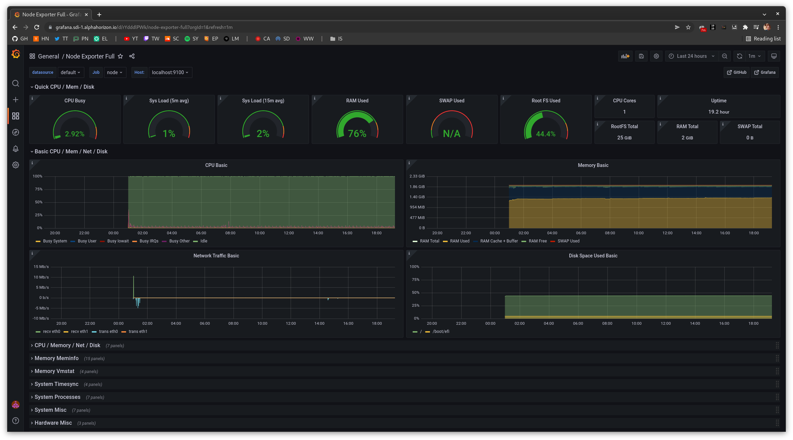

# Grafana

Grafana is a multi-platform open source analytics and interactive visualization web application[^note].

```shell
ssh jean@sdi-1.alphahorizon.io

sudo apt update
sudo apt install -y apt-transport-https software-properties-common

curl -L https://packages.grafana.com/gpg.key | sudo apt-key add -
echo 'deb https://packages.grafana.com/oss/deb stable main' | sudo tee -a /etc/apt/sources.list.d/grafana.list

sudo apt update
sudo apt install -y grafana

sudo systemctl enable --now grafana-server

sudo vi /etc/grafana/grafana.ini
# Replace the `[server]` block with the following:
[server]
http_port = 3001
# Replace the `[auth.ldap]` block with the following:
[auth.ldap]
enabled = true
config_file = /etc/grafana/ldap.toml
allow_sign_up = true
# Replace the `[log]` block with the following:
[log]
filters = ldap:debug
# Replace the `[smtp]` block with the following:
[smtp]
enabled = true
host = mail.gandi.net:465
user = sdi-1@alphahorizon.io
password = yourpassword
from_address = jeans-grafana@alphahorizon.io
from_name = Grafana
ehlo_identity = grafana.sdi-1.alphahorizon.io

sudo tee /etc/grafana/ldap.toml <<'EOT'
[[servers]]
host = "127.0.0.1"
port = 389
use_ssl = false
start_tls = false
ssl_skip_verify = false

bind_dn = "cn=admin,dc=ldap,dc=sdi-1,dc=alphahorizon,dc=io"
bind_password = 'yourpassword'
search_filter = "(uid=%s)"
#search_base_dns = ["dc=ldap,dc=sdi-1,dc=alphahorizon,dc=io"] # If we were to use groups
search_base_dns = ["ou=ops,ou=software,ou=departments,dc=ldap,dc=sdi-1,dc=alphahorizon,dc=io"]

[servers.attributes]
name = "givenName"
surname = "sn"
username = "cn"
member_of = "memberOf"
email =  "email"

# Would be useful if we were to use groups
#[[servers.group_mappings]]
#group_dn = "ou=ops,ou=software,ou=departments,dc=ldap,dc=sdi-1,dc=alphahorizon,dc=io"
#org_role = "Admin"
#
#[[servers.group_mappings]]
#group_dn = "ou=ops,ou=software,ou=departments,dc=ldap,dc=sdi-1,dc=alphahorizon,dc=io"
#org_role = "Editor"
#
#[[servers.group_mappings]]
#group_dn = "*"
#org_role = "Viewer"

[[servers.group_mappings]]
group_dn = "*"
org_role = "Admin"
EOT

sudo systemctl restart grafana-server

curl https://grafana.sdi-1.alphahorizon.io/ # Test the Grafana site

# Visit https://grafana.sdi-1.alphahorizon.io/ and login as `operator` using the password from LDAP; they will be admin. If we had set up roles, logging in as `bean` using `password` would make them a viewer.
# - Go to configuration, add a datasource and select Prometheus and use `http://localhost:9091` as the URL
# - Go to create, import and select `1860` as the ID (https://grafana.com/grafana/dashboards/1860), then select Prometheus as the data source
# - Go to create, folder and set `Main` as the name
# - Go to alerting, create alert with name `HostDiskWillFillIn24Hours`, type `Grafana managed alert` and folder `Mail` using the following query: `(node_filesystem_avail_bytes * 100) / node_filesystem_size_bytes < 10 and ON (instance, device, mountpoint) predict_linear(node_filesystem_avail_bytes{fstype!~"tmpfs"}[1h], 24 * 3600) < 0 and ON (instance, device, mountpoint) node_filesystem_readonly == 0`, `Host disk will fill in 24 hours (instance {{ $labels.instance }})` as the summary, `Filesystem is predicted to run out of space within the next 24 hours at current write rate\n VALUE = {{ $value }}\n LABELS: {{ $labels }}` as description and `serverity=warning` as the labels.
# - Go to https://grafana.sdi-1.alphahorizon.io/alerting/notifications/receivers/grafana-default-email/edit?alertmanager=grafana, enter your Email, and click on "Test". Now check your inbox, a test mail should have arrived.
# - Go to create, import and select `4475` as the ID (https://grafana.com/grafana/dashboards/4475), go to dashboard settings and select `apache@file` as the service
```

The Grafana dashboard should now look like the following:



[^note]: From Wikipedia, last checked 2022-02-19 ([https://en.wikipedia.org/wiki/Grafana](https://en.wikipedia.org/wiki/Grafana))
