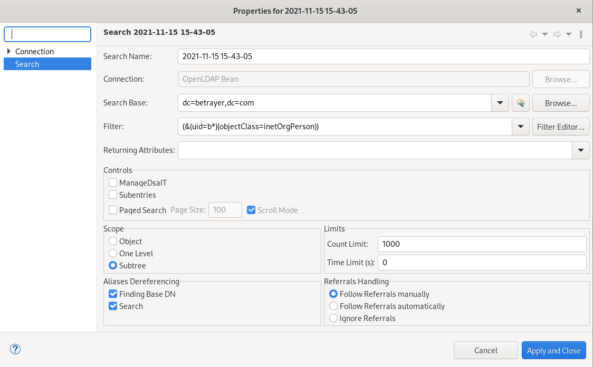
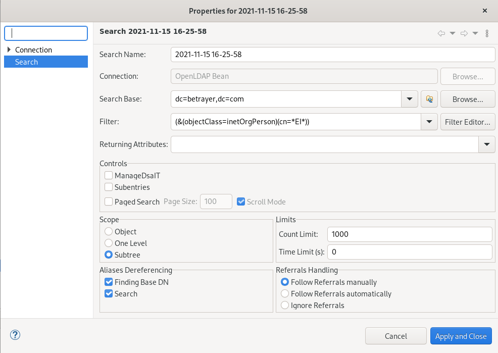
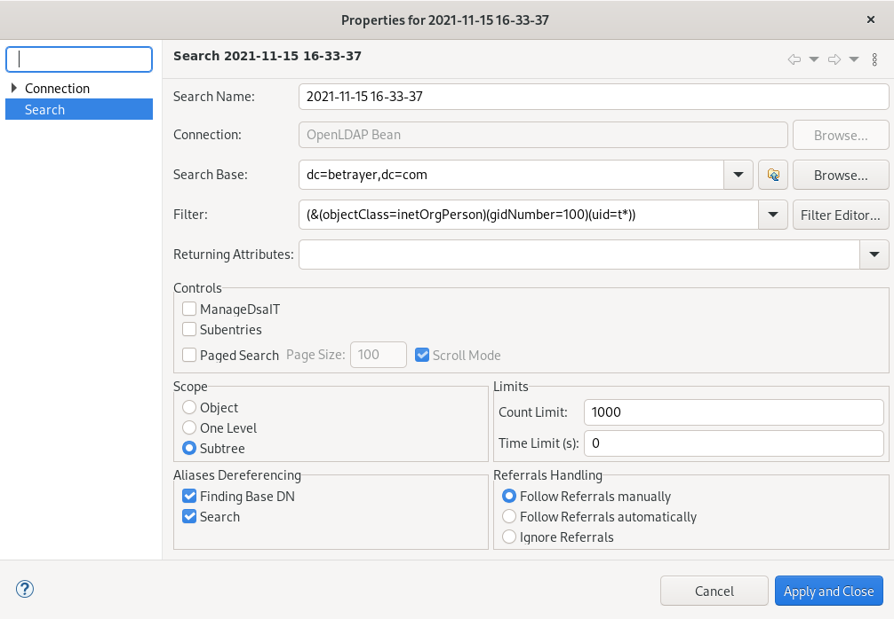
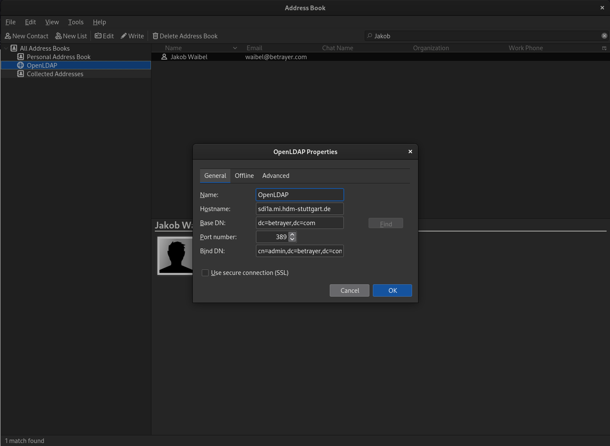
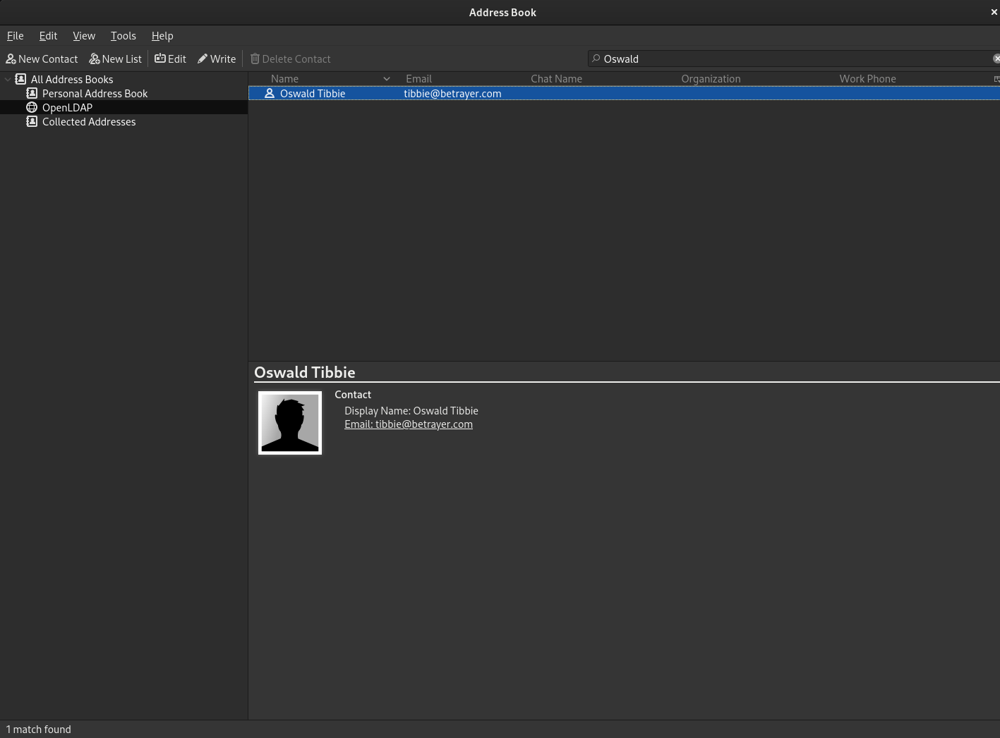
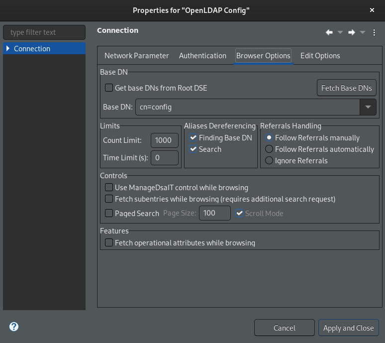
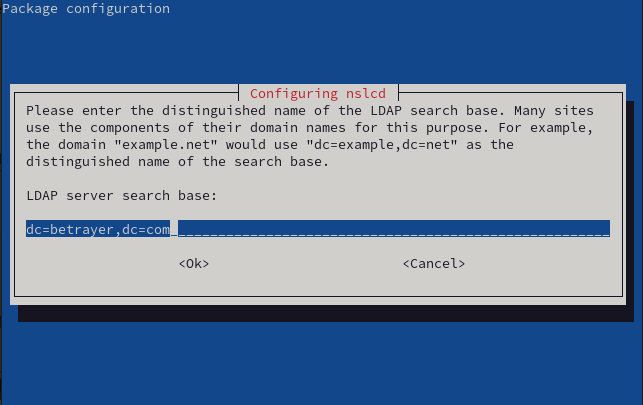

# LDAP Exercises

## Browsing an existing LDAP Server using Apache Directory Studio

To setup Apache Directory Studio to connect to the LDAP server, create a new connection with the following properties: 


If your connection was successful, your user interface should look somewhat like this: 


### Use a filter like (uid-xy234) to find your personal entry beneath ou=userlist,dc=hdm-stuttgart,dc=de, Use the corresponding DN e.g. uid=xy234, ou=userlist,dc=hdm-stuttgart,dc=de to reconnect using password authentication. Then browse your own entry again. Can you spot any difference?

Therefore, you right-click on the userlist and apply a filter on the children. This should work like displayed in the following two pictures.


As one can see in the picture below, the entry appears and can be examined further by clicking on it.


The other option to find ones own entry is to create a search. The content should look somewhat like in the following picture.


Then ones user should be found and can be examined. 


After following the same steps while being logged in, the user entry should look more like in the following picture. As one can see, some more personal information like the hash of the users password or his student-identification number is provided.


## Browsing an existing LDAP Server using `ldapsearch`

### Setup ldapsearch to anonymously connect to ldap1.hdm-stuttgart.de

The following command connects to the LDAP server and displays the information below. The output is a shortened version, as there are too many user entries to display here.

```shell
$ ldapsearch -x -b "ou=userlist,dc=hdm-stuttgart,dc=de" -H ldap://ldap1.hdm-stuttgart.de
```

```shell
# gast39, userlist, hdm-stuttgart.de
dn: uid=gast39,ou=userlist,dc=hdm-stuttgart,dc=de
hdmCategory: 4
sn: fixme
loginShell: /bin/sh
uidNumber: 46139
gidNumber: 35102
uid: gast39
objectClass: inetOrgPerson
objectClass: posixAccount
objectClass: shadowAccount
objectClass: hdmAccount
objectClass: hdmSambaDomain
objectClass: eduPerson
cn:: dW5rbm93biA=
homeDirectory: /home/stud/XX/gast39
givenName: Gast
eduPersonAffiliation: faculty
eduPersonAffiliation: library-walk-in

# gast38, userlist, hdm-stuttgart.de
dn: uid=gast38,ou=userlist,dc=hdm-stuttgart,dc=de
hdmCategory: 4
sn: fixme
loginShell: /bin/sh
uidNumber: 46138
gidNumber: 35102
uid: gast38
objectClass: inetOrgPerson
objectClass: posixAccount
objectClass: shadowAccount
objectClass: hdmAccount
objectClass: hdmSambaDomain
objectClass: eduPerson
cn:: dW5rbm93biA=
homeDirectory: /home/stud/XX/gast38
givenName: Gast
eduPersonAffiliation: faculty
eduPersonAffiliation: library-walk-in
```

### Use a filter like (uid-xy234) to find your personal entry beneath ou=userlist,dc=hdm-stuttgart,dc=de, Use the corresponding DN e.g. uid=xy234, ou=userlist,dc=hdm-stuttgart,dc=de to reconnect using password authentication. Then browse your own entry again. Can you spot any difference?	

```shell
$ ldapsearch -x -b "uid=jw163, ou=userlist,dc=hdm-stuttgart,dc=de" -H ldap://ldap1.hdm-stuttgart.de
# extended LDIF
#
# LDAPv3
# base <uid=jw163, ou=userlist,dc=hdm-stuttgart,dc=de> with scope subtree
# filter: (objectclass=*)
# requesting: ALL
#

# jw163, userlist, hdm-stuttgart.de
dn: uid=jw163,ou=userlist,dc=hdm-stuttgart,dc=de
displayName: Waibel Jakob Elias
employeeType: student
objectClass: hdmAccount
objectClass: hdmStudent
objectClass: inetOrgPerson
objectClass: posixAccount
objectClass: shadowAccount
objectClass: eduPerson
eduPersonAffiliation: member
eduPersonAffiliation: student
eduPersonAffiliation: library-walk-in
uid: jw163
mail: jw163@hdm-Stuttgart.de
uidNumber: 67828
cn: Waibel Jakob Elias
loginShell: /bin/sh
hdmCategory: 1
gidNumber: 100
givenName: Jakob Elias
homeDirectory: /home/stud/j/jw163
sn: Waibel

# search result
search: 2
result: 0 Success

# numResponses: 2
# numEntries: 1
```

After being logged in, we can spot some more information:

```shell
$ ldapsearch -x -D "uid=jw163, ou=userlist,dc=hdm-stuttgart,dc=de"  -W -H ldap://ldap1.hdm-stuttgart.de -b " uid=jw163, ou=userlist,dc=hdm-stuttgart,dc=de"  -s sub 'uid=jw163'
Enter LDAP Password: 
# extended LDIF
#
# LDAPv3
# base < uid=jw163, ou=userlist,dc=hdm-stuttgart,dc=de> with scope subtree
# filter: uid=jw163
# requesting: ALL
#

# jw163, userlist, hdm-stuttgart.de
dn: uid=jw163,ou=userlist,dc=hdm-stuttgart,dc=de
businessCategory: 1
businessCategory: {11112-3}
employeeType: student
postOfficeBox: 2G
objectClass: hdmAccount
objectClass: hdmStudent
objectClass: inetOrgPerson
objectClass: posixAccount
objectClass: shadowAccount
objectClass: eduPerson
eduPersonAffiliation: member
eduPersonAffiliation: student
eduPersonAffiliation: library-walk-in
uid: jw163
mail: jw163@hdm-Stuttgart.de
uidNumber: 67828
cn: Waibel Jakob Elias
loginShell: /bin/sh
hdmCategory: 1
gidNumber: 100
employeeNumber: CENSORED
givenName: Jakob Elias
homeDirectory: /home/stud/j/jw163
sn: Waibel
matrikelNr: CENSORED 
userPassword:: CENSORED
shadowLastChange: 18316
sambaNTPassword: CENSORED

# search result
search: 2
result: 0 Success

# numResponses: 2
# numEntries: 1
```

## Setup an OpenLDAP server

First of all, one might use the following commands to install some useful utilities.

```shell
# apt install dialog
```

```shell
# apt install slapd
```

In the following, the admin password is set to `password`. Please make sure you are using a more secure password than we are when configuring your LDAP server.	

With `dpkg-reconfigure slapd`, you can modify your base configuration. Following the dialog accordingly should lead to  a successful result.


After setting up slapd, we can use `ss -tlnp` to verify that a server is running.

```shell
# ss -tlnp
State                    Recv-Q                   Send-Q                                     Local Address:Port                                       Peer Address:Port                   Process                                             
LISTEN                   0                        10                                         141.62.75.101:53                                              0.0.0.0:*                       users:(("named",pid=448,fd=19))                    
LISTEN                   0                        10                                             127.0.0.1:53                                              0.0.0.0:*                       users:(("named",pid=448,fd=16))                    
LISTEN                   0                        128                                              0.0.0.0:22                                              0.0.0.0:*                       users:(("sshd",pid=127,fd=3))                      
LISTEN                   0                        4096                                           127.0.0.1:953                                             0.0.0.0:*                       users:(("named",pid=448,fd=21))                    
LISTEN                   0                        100                                            127.0.0.1:25                                              0.0.0.0:*                       users:(("master",pid=292,fd=13))                   
LISTEN                   0                        1024                                             0.0.0.0:389                                             0.0.0.0:*                       users:(("slapd",pid=7245,fd=8))                    
LISTEN                   0                        128                                                 [::]:22                                                 [::]:*                       users:(("sshd",pid=127,fd=4))                      
LISTEN                   0                        100                                                [::1]:25                                                 [::]:*                       users:(("master",pid=292,fd=14))                   
LISTEN                   0                        1024                                                [::]:389                                                [::]:*                       users:(("slapd",pid=7245,fd=9))
```

```shell
ldapsearch -Q -LLL -Y EXTERNAL -H ldapi:/// -b cn=config dn
dn: cn=config

dn: cn=module{0},cn=config

dn: cn=schema,cn=config

dn: cn={0}core,cn=schema,cn=config

dn: cn={1}cosine,cn=schema,cn=config

dn: cn={2}nis,cn=schema,cn=config

dn: cn={3}inetorgperson,cn=schema,cn=config

dn: olcDatabase={-1}frontend,cn=config

dn: olcDatabase={0}config,cn=config

dn: olcDatabase={1}mdb,cn=config
```

```shell
# ldapwhoami -x 
anonymous
```

As mentioned in the task, we need to rename the `dc` to `betrayer.com`. So we just do `dpkg-reconfigure slapd` another time using the required information.


We can now use `ldapwhoami` with our configuration:

```shell
# ldapwhoami -x -D cn=admin,dc=betrayer,dc=com -W
Enter LDAP Password: 
dn:cn=admin,dc=betrayer,dc=com
```

We can connect to our server using Apache Directory Studio with the following configuration.


To authorize as an administrator, we just use our admin credentials.


## Populating your DIT

After creating our LDAP tree, it looks like this: 


Our export dump looks like this: 

```ldif
version: 1

dn: dc=betrayer,dc=com
objectClass: dcObject
objectClass: organization
objectClass: top
dc: betrayer
o: betrayer.com

dn: cn=admin,dc=betrayer,dc=com
objectClass: organizationalRole
objectClass: simpleSecurityObject
cn: admin
userPassword:: e1NTSEF9cEhFK0VQT0cyZ3lSeU9nanZGcXNXT2I1ekdzR2w5Q0Q=
description: LDAP administrator

dn: ou=departments,dc=betrayer,dc=com
objectClass: organizationalUnit
objectClass: top
ou: departments

dn: ou=software,ou=departments,dc=betrayer,dc=com
objectClass: organizationalUnit
objectClass: top
ou: software

dn: ou=financial,ou=departments,dc=betrayer,dc=com
objectClass: organizationalUnit
objectClass: top
ou: financial

dn: ou=devel,ou=software,ou=departments,dc=betrayer,dc=com
objectClass: organizationalUnit
objectClass: top
ou: devel

dn: ou=testing,ou=software,ou=departments,dc=betrayer,dc=com
objectClass: organizationalUnit
objectClass: top
ou: testing

dn: uid=bean,ou=devel,ou=software,ou=departments,dc=betrayer,dc=com
objectClass: inetOrgPerson
objectClass: organizationalPerson
objectClass: person
objectClass: top
cn: Audrey Bean
sn: Bean
givenName: Audrey
mail: bean@betrayer.com
uid: bean
userPassword:: e3NtZDV9YVhKL2JlVkF2TDRENk9pMFRLcDhjM3ovYTZQZzBXeHA=

dn: uid=smith,ou=devel,ou=software,ou=departments,dc=betrayer,dc=com
objectClass: inetOrgPerson
objectClass: organizationalPerson
objectClass: person
objectClass: top
cn: Jane Smith
sn: Smith
givenName: Jane
mail: smith@betrayer.com
uid: smith
userPassword:: e3NtZDV9YVhKL2JlVkF2TDRENk9pMFRLcDhjM3ovYTZQZzBXeHA=

dn: uid=waibel,ou=financial,ou=departments,dc=betrayer,dc=com
objectClass: inetOrgPerson
objectClass: organizationalPerson
objectClass: person
objectClass: top
cn: Jakob Waibel
sn: Waibel
givenName: Jakob
mail: waibel@betrayer.com
uid: waibel
userPassword:: e3NtZDV9YVhKL2JlVkF2TDRENk9pMFRLcDhjM3ovYTZQZzBXeHA=

dn: uid=simpson,ou=financial,ou=departments,dc=betrayer,dc=com
objectClass: inetOrgPerson
objectClass: organizationalPerson
objectClass: person
objectClass: top
cn: Homer Simpson
sn: Simpson
givenName: Homer
mail: simpson@betrayer.com
uid: simpson
userPassword:: e3NtZDV9YVhKL2JlVkF2TDRENk9pMFRLcDhjM3ovYTZQZzBXeHA=

dn: uid=pojtinger,ou=testing,ou=software,ou=departments,dc=betrayer,dc=com
objectClass: inetOrgPerson
objectClass: organizationalPerson
objectClass: person
objectClass: top
cn: Felicitas Pojtinger
sn: Pojtinger
givenName: Felicitas
mail: pojtinger@betrayer.com
uid: pojtinger
userPassword:: e3NtZDV9YVhKL2JlVkF2TDRENk9pMFRLcDhjM3ovYTZQZzBXeHA=

dn: uid=simpson,ou=testing,ou=software,ou=departments,dc=betrayer,dc=com
objectClass: inetOrgPerson
objectClass: organizationalPerson
objectClass: person
objectClass: top
cn: Maggie Simpson
sn: Simpson
givenName: Maggie
mail: simpson@betrayer.com
uid: simpson
userPassword:: e3NtZDV9YVhKL2JlVkF2TDRENk9pMFRLcDhjM3ovYTZQZzBXeHA=
```

## Testing a bind operation as non-admin user

First we set a password for `bean`. In our case, we set the password to `password`.


Afterwards we create a new connection with the following properties for the authentication section:


After that, our new connection looks like this: 


## Extending an existing entry

To extend an existing entry and to add a `posixAccount`, one needs to right-click on the `objectClass` attribute and click on `New Value`.  


After that look for the `posixAccount` like displayed in the screenshot and `Add` it so it appears in the right column. After clicking `Next`, one needs to specify a valid `gidNumber`, `homeDirectory` and `uidNumber`. Now complete the configuration by clicking on `Finish`.

## Filter based search

### All users with a uid attribute value starting with the letter “b”.




### All entries either with either a defined uid attribute or a ou attribute starting with letter “d”.


### All users entries within the whole DIT having a gidNumber value of 100.


### All user entries belonging to the billing department having a uid value greater than 1023.


### All user entries within the whole DIT having a commonName containing the substring “ei”.




### All user entries within the whole DIT belonging to gidNumber == 100 or having a uid value starting with letter “t”.




## Accessing LDAP data by a mail client

To use LDAP data with a mail client, it is necessary to add a new address book. It's configuration is displayed in the picture below:



After configuring the address book, addresses are only available when searching. As shown in the following picture, we can now find the fictional characters we created when populating our tree. 



## LDAP configuration

```bash
# ldapsearch -Y EXTERNAL -H ldapi:/// -b cn=config
SASL/EXTERNAL authentication started
SASL username: gidNumber=0+uidNumber=0,cn=peercred,cn=external,cn=auth
SASL SSF: 0
# extended LDIF
#
# LDAPv3
# base <cn=config> with scope subtree
# filter: (objectclass=*)
# requesting: ALL
#

# config
dn: cn=config
objectClass: olcGlobal
cn: config
olcArgsFile: /var/run/slapd/slapd.args
olcLogLevel: none
olcPidFile: /var/run/slapd/slapd.pid
olcToolThreads: 1

# module{0}, config
dn: cn=module{0},cn=config
objectClass: olcModuleList
cn: module{0}
olcModulePath: /usr/lib/ldap
olcModuleLoad: {0}back_mdb

# schema, config
dn: cn=schema,cn=config
objectClass: olcSchemaConfig
cn: schema
olcObjectIdentifier: OLcfg 1.3.6.1.4.1.4203.1.12.2
olcObjectIdentifier: OLcfgAt OLcfg:3
olcObjectIdentifier: OLcfgGlAt OLcfgAt:0
...
olcDatabase: {-1}frontend
olcAccess: {0}to * by dn.exact=gidNumber=0+uidNumber=0,cn=peercred,cn=external
 ,cn=auth manage by * break
olcAccess: {1}to dn.exact="" by * read
olcAccess: {2}to dn.base="cn=Subschema" by * read
olcSizeLimit: 500

# {0}config, config
dn: olcDatabase={0}config,cn=config
objectClass: olcDatabaseConfig
olcDatabase: {0}config
olcAccess: {0}to * by dn.exact=gidNumber=0+uidNumber=0,cn=peercred,cn=external
 ,cn=auth manage by * break
olcRootDN: cn=admin,cn=config

# {1}mdb, config
dn: olcDatabase={1}mdb,cn=config
objectClass: olcDatabaseConfig
objectClass: olcMdbConfig
olcDatabase: {1}mdb
olcDbDirectory: /var/lib/ldap
olcSuffix: dc=betrayer,dc=com
olcAccess: {0}to attrs=userPassword by self write by anonymous auth by * none
olcAccess: {1}to attrs=shadowLastChange by self write by * read
olcAccess: {2}to * by * read
olcLastMod: TRUE
olcRootDN: cn=admin,dc=betrayer,dc=com
olcRootPW: {SSHA}0mF0mX3FUNd0zZ0u3bKPQQA1ubycnHvh
olcDbCheckpoint: 512 30
olcDbIndex: objectClass eq
olcDbIndex: cn,uid eq
olcDbIndex: uidNumber,gidNumber eq
olcDbIndex: member,memberUid eq
olcDbMaxSize: 1073741824

# search result
search: 2
result: 0 Success

# numResponses: 11
# numEntries: 10
```

As mentioned in the task, we find the required information near the end of the output. In the first occurence of `oldRootDN`, where `olcRootDN: cn=admin,cn=config`, no passwort is set afterwards. In the second occurence `olcRootDN=cn=admin,dc=betrayer,dc=com`, a password is set with `oldRootPW`. This password not being specified implies that configuration access is limited to localhost.

To change these settings, we must create a LDIF file which sets the required properties. A password hash can be generated using a website like: https://projects.marsching.org/weave4j/util/genpassword.php. We chose to use the password `password` again. 

```bash
# cat add_olcRootPW.ldif 
dn: olcDatabase={0}config,cn=config
replace: olcRootPW
olcRootPW: {ssha}U1oLsngiAsXhFQrav5UzHxn2/9qPNcL+
```

```bash
# ldapmodify -Q -Y EXTERNAL -H ldapi:/// -f ~/add_olcRootPW.ldif
modifying entry "olcDatabase={0}config,cn=config"

```




After connecting, we can set the `olcLogLevel`. There are multiple options to set the log level to. We decided to get the most information possible, which is achieved by using the `olcLogLevel` of `-1`. 


Now we can look at the syslog with `cat /var/log/syslog`. 


## LDAP based user login

First, we create a backup of our working PAM configuration.

```bash
cd /etc
tar zcf /root/pam.tgz pam.conf pam.d
```

We can then check if everything worked properly:

```bash
# tar ztf /root/pam.tgz 
pam.conf
pam.d/
pam.d/passwd
pam.d/sshd
pam.d/common-auth
pam.d/common-session-noninteractive
pam.d/runuser-l
pam.d/su
pam.d/other
pam.d/su-l
pam.d/cron
pam.d/runuser
pam.d/common-password
pam.d/chpasswd
pam.d/common-session
pam.d/chsh
pam.d/login
pam.d/common-account
pam.d/newusers
pam.d/chfn
```

Install `libpam-ldapd` via `apt install libpam-ldapd`.

Configure the server like displayed in the following screenshots.





Then we reboot our server and continue the configuration.

Test your LDAP setup: 

```bash
# id waibel
uid=1337(waibel) gid=100(users) groups=100(users)
```

Edit the `passwd`, `group` and `shadow` line in your `/etc/nsswitch.conf` so that they look similar than in our configuration: 

```bash
# cat /etc/nsswitch.conf 
# /etc/nsswitch.conf
#
# Example configuration of GNU Name Service Switch functionality.
# If you have the `glibc-doc-reference' and `info' packages installed, try:
# `info libc "Name Service Switch"' for information about this file.

passwd:         files ldap
group:          files ldap
shadow:         files ldap
gshadow:        files

hosts:          files dns
networks:       files

protocols:      db files
services:       db files
ethers:         db files
rpc:            db files

netgroup:       nis
```

Make sure that `PasswordAuthentication` is set to `no` in `/etc/ssh/sshd_config`:

```bash
# cat /etc/ssh/sshd_config
#	$OpenBSD: sshd_config,v 1.103 2018/04/09 20:41:22 tj Exp $

# This is the sshd server system-wide configuration file.  See
# sshd_config(5) for more information.

# This sshd was compiled with PATH=/usr/bin:/bin:/usr/sbin:/sbin

# The strategy used for options in the default sshd_config shipped with
# OpenSSH is to specify options with their default value where
# possible, but leave them commented.  Uncommented options override the
# default value.

Include /etc/ssh/sshd_config.d/*.conf

#Port 22
#AddressFamily any
#ListenAddress 0.0.0.0
#ListenAddress ::

#HostKey /etc/ssh/ssh_host_rsa_key
#HostKey /etc/ssh/ssh_host_ecdsa_key
#HostKey /etc/ssh/ssh_host_ed25519_key

# Ciphers and keying
#RekeyLimit default none

# Logging
#SyslogFacility AUTH
#LogLevel INFO

# Authentication:

#LoginGraceTime 2m
#PermitRootLogin prohibit-password
#StrictModes yes
#MaxAuthTries 6
#MaxSessions 10

#PubkeyAuthentication yes

# Expect .ssh/authorized_keys2 to be disregarded by default in future.
#AuthorizedKeysFile	.ssh/authorized_keys .ssh/authorized_keys2

#AuthorizedPrincipalsFile none

#AuthorizedKeysCommand none
#AuthorizedKeysCommandUser nobody

# For this to work you will also need host keys in /etc/ssh/ssh_known_hosts
#HostbasedAuthentication no
# Change to yes if you don't trust ~/.ssh/known_hosts for
# HostbasedAuthentication
#IgnoreUserKnownHosts no
# Don't read the user's ~/.rhosts and ~/.shosts files
#IgnoreRhosts yes

# To disable tunneled clear text passwords, change to no here!
PasswordAuthentication no
#PermitEmptyPasswords no

# Change to yes to enable challenge-response passwords (beware issues with
# some PAM modules and threads)
ChallengeResponseAuthentication no

# Kerberos options
#KerberosAuthentication no
#KerberosOrLocalPasswd yes
#KerberosTicketCleanup yes
#KerberosGetAFSToken no

# GSSAPI options
#GSSAPIAuthentication no
#GSSAPICleanupCredentials yes
#GSSAPIStrictAcceptorCheck yes
#GSSAPIKeyExchange no

# Set this to 'yes' to enable PAM authentication, account processing,
# and session processing. If this is enabled, PAM authentication will
# be allowed through the ChallengeResponseAuthentication and
# PasswordAuthentication.  Depending on your PAM configuration,
# PAM authentication via ChallengeResponseAuthentication may bypass
# the setting of "PermitRootLogin without-password".
# If you just want the PAM account and session checks to run without
# PAM authentication, then enable this but set PasswordAuthentication
# and ChallengeResponseAuthentication to 'no'.
UsePAM yes

#AllowAgentForwarding yes
#AllowTcpForwarding yes
#GatewayPorts no
X11Forwarding yes
#X11DisplayOffset 10
#X11UseLocalhost yes
#PermitTTY yes
PrintMotd no
#PrintLastLog yes
#TCPKeepAlive yes
#PermitUserEnvironment no
#Compression delayed
#ClientAliveInterval 0
#ClientAliveCountMax 3
#UseDNS no
#PidFile /var/run/sshd.pid
#MaxStartups 10:30:100
#PermitTunnel no
#ChrootDirectory none
#VersionAddendum none

# no default banner path
#Banner none

# Allow client to pass locale environment variables
AcceptEnv LANG LC_*

# override default of no subsystems
Subsystem	sftp	/usr/lib/openssh/sftp-server

# Example of overriding settings on a per-user basis
#Match User anoncvs
#	X11Forwarding no
#	AllowTcpForwarding no
#	PermitTTY no
#	ForceCommand cvs server
```

To make sure the results are not influenced by unwanted caching, we stop the `nscd` service.

```bash
# systemctl stop nscd
# systemctl status nscd
● nscd.service - Name Service Cache Daemon
     Loaded: loaded (/lib/systemd/system/nscd.service; enabled; vendor preset:>
     Active: inactive (dead) since Wed 2021-11-17 21:26:35 CET; 4s ago
    Process: 77 ExecStart=/usr/sbin/nscd (code=exited, status=0/SUCCESS)
    Process: 364 ExecStop=/usr/sbin/nscd --shutdown (code=exited, status=0/SUC>
   Main PID: 80 (code=exited, status=0/SUCCESS)

Nov 17 21:17:27 sdi1b nscd[80]: 80 monitoring directory `/etc` (2)
Nov 17 21:17:27 sdi1b nscd[80]: 80 monitoring file `/etc/services` (6)
Nov 17 21:17:27 sdi1b nscd[80]: 80 monitoring directory `/etc` (2)
Nov 17 21:17:27 sdi1b nscd[80]: 80 disabled inotify-based monitoring for file >
Nov 17 21:17:27 sdi1b nscd[80]: 80 stat failed for file `/etc/netgroup'; will >
Nov 17 21:17:27 sdi1b systemd[1]: Started Name Service Cache Daemon.
Nov 17 21:17:46 sdi1b nscd[80]: 80 checking for monitored file `/etc/netgroup'>
Nov 17 21:26:35 sdi1b systemd[1]: Stopping Name Service Cache Daemon...
Nov 17 21:26:35 sdi1b systemd[1]: nscd.service: Succeeded.
Nov 17 21:26:35 sdi1b systemd[1]: Stopped Name Service Cache Daemon.
```

With `mkhomedir_helper waibel`, we create a new homedirectory and modify the access rights. The result should look somewhat like this:

```bash
drwxr-xr-x  2 waibel users   5 Nov 17 21:32 jakob
```

```bash 
# id waibel
uid=1337(waibel) gid=100(users) groups=100(users)
```

## Backup and recovery/restore

First, we setup a second LDAP server on `sdi1b.mi.hdm-stuttgart.de`. 

Now we dump the configuration and the data into ldif files.
```bash
# slapcat -b cn=config -l ldap-config.ldif 
# slapcat -l ldap-data.ldif
```

After creating an ssh-key on `sdi1a` and adding its public key to the `authorized_keys` file on `sdi1b` we can use scp to transfer the files from `sdi1a` to `sdi1b`.

```bash
# scp {ldap-config.ldif,ldap-data.ldif} root@sdi1b.mi.hdm-stuttgart.de:~
ldap-config.ldif                             100%   38KB  18.0MB/s   00:00    
ldap-data.ldif                               100% 7977    19.0MB/s   00:00    
```

On `sdi1b` we stop the `slapd` service with `systemctl stop slapd` and we restore the configuration and data using `slapadd`:

```bash
# slapadd -b cn=config -l ~/ldap-config.ldif -F /etc/ldap/slapd.d/
# slapadd -n 1 -l ~/ldap-data.ldif -F /etc/ldap/slapd.d/
```

To ensure everything worked, we create a new ldif file based on the data on the backup server. Afterwards, the new ldif file can be displayed and we can see that everything worked.

```bash
# slapcat -l ldap-data-b.ldif
```

```bash 
# cat ldap-data-b.ldif 
dn: dc=betrayer,dc=com
structuralObjectClass: organization
entryUUID: 1c2b9bf0-d8b8-103b-9330-2bdbf336837c
creatorsName: cn=admin,dc=betrayer,dc=com
createTimestamp: 20211113102755Z
objectClass: organization
objectClass: dcObject
objectClass: top
dc: betrayer
o: betrayer.com
entryCSN: 20211115133040.851821Z#000000#000#000000
modifiersName: cn=admin,dc=betrayer,dc=com
modifyTimestamp: 20211115133040Z

dn: cn=admin,dc=betrayer,dc=com
description: LDAP administrator
cn: admin
objectClass: organizationalRole
objectClass: simpleSecurityObject
userPassword:: e1NTSEF9cEhFK0VQT0cyZ3lSeU9nanZGcXNXT2I1ekdzR2w5Q0Q=
structuralObjectClass: organizationalRole
entryUUID: f89e4158-da63-103b-9b6b-03efa5ff8503
creatorsName: cn=admin,dc=betrayer,dc=com
createTimestamp: 20211115133040Z
entryCSN: 20211115133040.866711Z#000000#000#000000
modifiersName: cn=admin,dc=betrayer,dc=com
modifyTimestamp: 20211115133040Z

dn: ou=departments,dc=betrayer,dc=com
ou: departments
objectClass: top
objectClass: organizationalUnit
structuralObjectClass: organizationalUnit
entryUUID: f89f5066-da63-103b-9b6c-03efa5ff8503
creatorsName: cn=admin,dc=betrayer,dc=com
createTimestamp: 20211115133040Z
entryCSN: 20211115133040.873650Z#000000#000#000000
modifiersName: cn=admin,dc=betrayer,dc=com
modifyTimestamp: 20211115133040Z

dn: ou=software,ou=departments,dc=betrayer,dc=com
ou: software
objectClass: top
objectClass: organizationalUnit
structuralObjectClass: organizationalUnit
entryUUID: f8a05240-da63-103b-9b6d-03efa5ff8503
creatorsName: cn=admin,dc=betrayer,dc=com
createTimestamp: 20211115133040Z
entryCSN: 20211115133040.880251Z#000000#000#000000
modifiersName: cn=admin,dc=betrayer,dc=com
modifyTimestamp: 20211115133040Z
...
```

## Accessing LDAP by a Go application

```Go
package main

import (
	"flag"
	"fmt"
	"log"

	"github.com/go-ldap/ldap"
)

func main() {
	uid := flag.String("uid", "", "User-Id e.g. jw163")
	password := flag.String("pw", "", "Password e.g. password")
	flag.Parse()

	ldapURL := "ldaps://ldap1.mi.hdm-stuttgart.de"
	l, err := ldap.DialURL(ldapURL)
	if err != nil {
		log.Fatal(err)
	}

	defer l.Close()
	err = l.Bind(fmt.Sprintf("uid=%s, ou=userlist,dc=hdm-stuttgart,dc=de", *uid), *password)
	if err != nil {
		log.Fatal(err)
	}

	BaseDN := "dc=hdm-stuttgart,dc=de"
	Filter := fmt.Sprintf("(uid=%s)", *uid)
	searchReq := ldap.NewSearchRequest(
		BaseDN,
		ldap.ScopeWholeSubtree,
		ldap.NeverDerefAliases,
		0,
		0,
		false,
		Filter,
		[]string{},
		nil,
	)
	result, err := l.Search(searchReq)
	if err != nil {
		log.Fatal(err)
	}

	if len(result.Entries) > 0 {
		result.PrettyPrint(4)
	} else {
		fmt.Println("Couldn't fetch search entries")
	}
}
```

When executing the program, the output looks like this: 

```bash
$ go run main.go --uid=jw163 --pw=CENSORED
    DN: uid=jw163,ou=userlist,dc=hdm-stuttgart,dc=de
      objectClass: [hdmAccount hdmStudent inetOrgPerson posixAccount shadowAccount eduPerson]
      uid: [jw163]
      mail: [jw163@hdm-Stuttgart.de]
      uidNumber: [67828]
      cn: [Waibel Jakob Elias]
      loginShell: [/bin/sh]
      hdmCategory: [1]
      gidNumber: [100]
      givenName: [Jakob Elias]
      homeDirectory: [/home/stud/j/jw163]
      sn: [Waibel]
      matrikelNr: [40062]
```