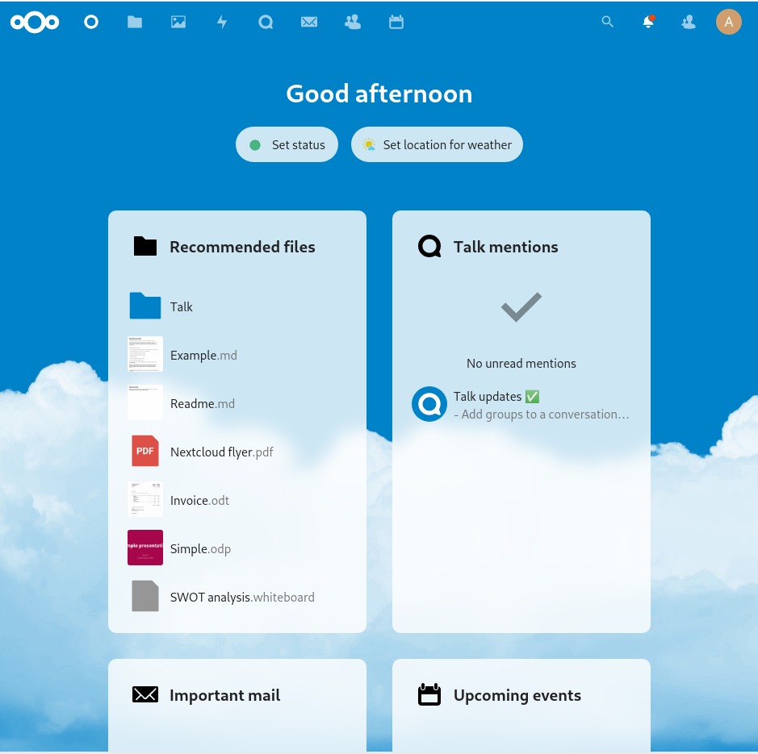
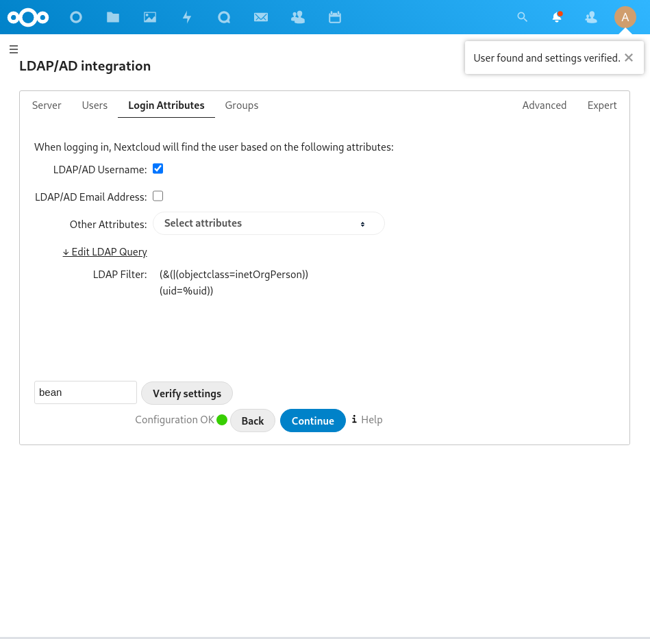

# Nextcloud Exercises

## Installation 

```shell
# apt update 
# apt -y install mariadb-server mariadb-client
```

Configure mysql using the installation script, set a root password, disable remote login and remove test databases.

```shell
# mysql_secure_installation
```

Ensure the password is required to access MySQL CLI as root user:

```shell
# mysql -u root
UPDATE mysql.user SET plugin = 'mysql_native_password' WHERE User = 'root';
FLUSH PRIVILEGES;
```

```shell
# mysql -u root -p
CREATE USER 'jakob'@'locahost' IDENTIFIED BY 'password';
CREATE DATABASE nextcloud;
GRANT ALL PRIVILEGES ON nextcloud.* 'jakob'@'localhost';
FLUSH PRIVILEDGES;
QUIT
```

Install PHP and Apache web server. In our case Apache is already installed. 

```shell
apt -y install php php-{cli,xml,zip,curl,gd,cgi,mysql,mbstring}

apt -y install apache2 libapache2-mod-php
```

Configure PHP variables: 

```shell
vim /etc/php/*/apache2/php.ini
date.timezone = Europe/Berlin
memory_limit = 512M
upload_max_filesize = 500M
post_max_size = 500M
max_execution_time = 300
```

Restart apache: 

```
systemctl restart apache2
```

Download nextcloud, curl and unzip: 

```shell
apt -y install curl unzip
curl -o nextcloud-22.zip https://download.nextcloud.com/server/releases/latest-22.zip
unzip nextcloud-22.zip
```

```shell
mv nextcloud /var/www/
chown -R www-data:root /var/html/nextcloud
chmod -R 755 /var/www/nextcloud
```

Add the nextcloud directory to our config: 

```shell
Alias /nextcloud "/var/www/nextcloud/"

<Directory "/var/www/nextcloud/">
    Require all granted 
    AllowOverride None 
    Options Indexes Multiviews

    <IfModule mod_dav.c>
      Dav off
    </IfModule> 
</Directory>
```

Create a new virtual host: 

```shell
<VirtualHost *:80>
	ServerAdmin jw163@hdm-stuttgart.de
	DocumentRoot /var/www/nextcloud
	ServerName mi.hdm-stuttgart.de
	ServerAlias nextcloud.mi.hdm-stuttgart.de
	ErrorLog ${APACHE_LOG_DIR}/error.log
	CustomLog ${APACHE_LOG_DIR}/access.log combined
</VirtualHost>
```

Restart `apache2`: 

```shell
# systemctl restart apache2
```

Now, nextcloud can be configured using the web interface: 



## LDAP Authentication 

After enabling the LDAP plugin, you can configure it and test login with one of your users. As can be seen in the following screenshot, we can login using one of our custom users:

